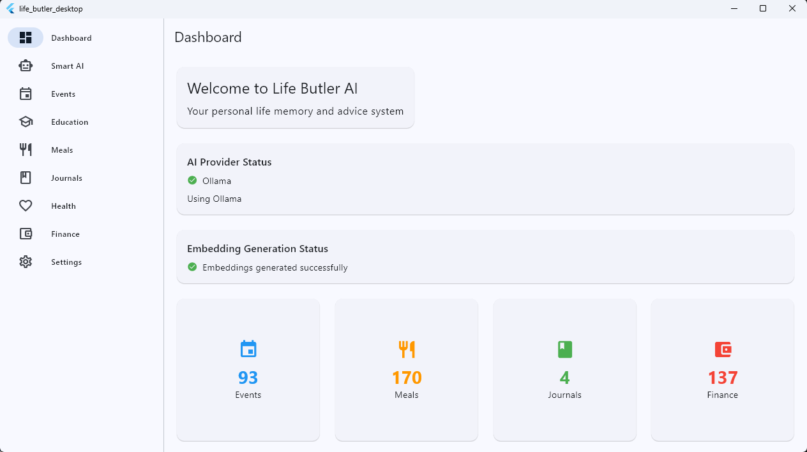
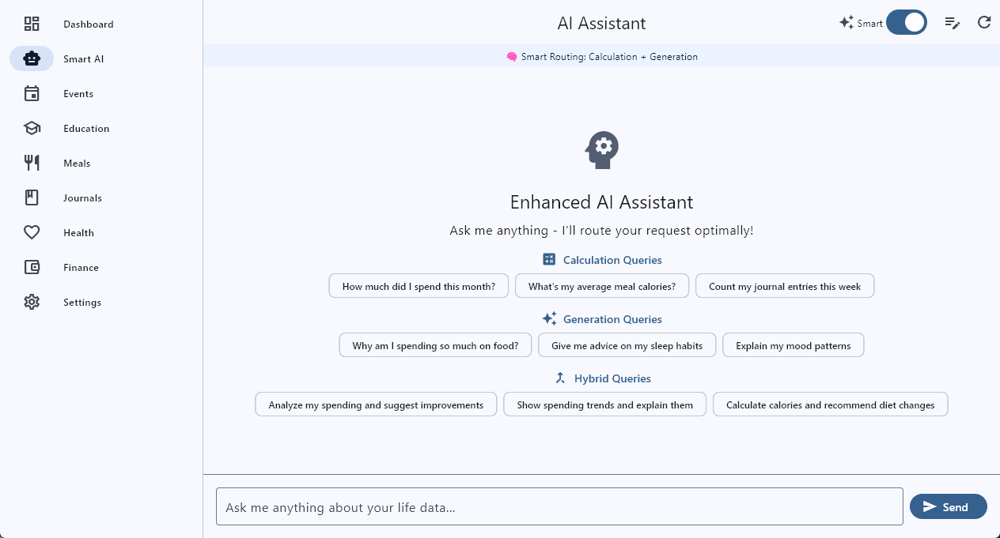
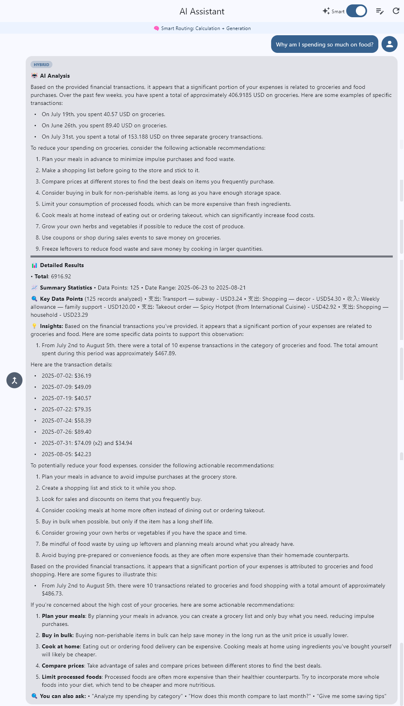
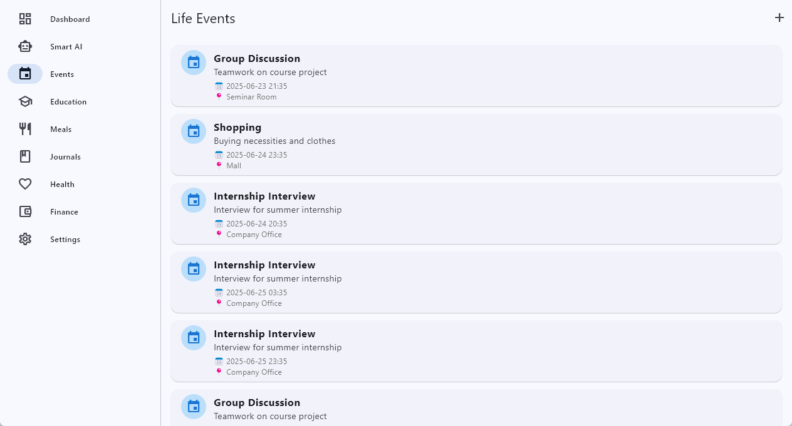
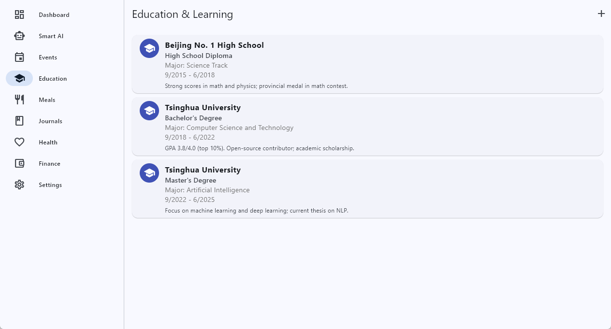
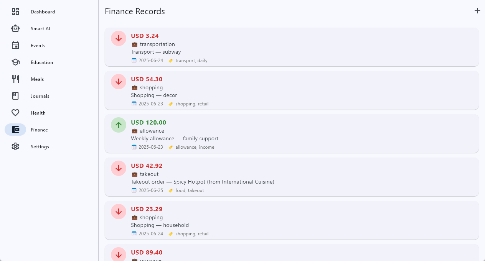

# Life Butler AI

[中文](README_zh.md)

🤖 **Your Personal Life Assistant**

Life Butler is a privacy-first, local-first personal life management system that transforms how you organize, query, and gain insights from your daily activities. Built with Flutter for beautiful desktop experiences and powered by cutting-edge RAG (Retrieval-Augmented Generation) technology, it's your intelligent companion for managing everything from health records to financial planning.













## 🚀 Quick Start (Development)

### Manual Setup

1. **Install dependencies for each package:**

   ```powershell
   # from PowerShell (Windows)
   cd apps\desktop; flutter pub get; cd ..\..\packages\core; dart pub get; cd ../data; dart pub get; cd ../providers_llm; dart pub get; cd ..\..
   ```

Life Butler AI is a privacy-first, local-first personal life management system that transforms how you organize, query, and gain insights from your daily activities. Built with Flutter for beautiful desktop experiences and powered by cutting-edge RAG (Retrieval-Augmented Generation) technology, it's your intelligent companion for managing everything from health records to financial planning.

## ✨ Why Life Butler AI?

**🔐 Privacy by Design**
- All your personal data stays on your device - no cloud storage required
- Local AI processing with Ollama - your conversations never leave your computer
- Complete control over your information

**🧠 Intelligent & Context-Aware**
- Ask natural language questions about your life: "How much did I spend on groceries last month?"
- RAG-powered responses using your actual data for accurate, personalized insights
- Smart categorization and pattern recognition across all your activities

**📊 Comprehensive Life Tracking**
- **Health & Wellness**: Track symptoms, medications, exercise, sleep patterns
- **Financial Management**: Expenses, income, budgets, and spending analysis
- **Meal Planning**: Food logs, nutrition tracking, recipe management
- **Event Management**: Calendar integration, task tracking, goal setting
- **Learning & Growth**: Educational progress, skill development, journal entries
- **And much more**: 14 integrated life domains in a unified system

**🛠️ Developer-Friendly Architecture**
- Clean multi-package monorepo structure
- Modular design - swap AI providers, extend UI, or integrate new data sources
- Pure Dart business logic separate from UI concerns
- Comprehensive test coverage and documentation

## 🚀 Quick highlights
- **apps/desktop** — Flutter Material 3 desktop app with modern, intuitive UI
- **packages/core** — Pure Dart business logic and RAG pipeline implementation
- **packages/data** — Drift ORM with 14-table schema covering all life domains
- **packages/providers_llm** — Flexible AI provider abstractions (Ollama integration included)

## 🚀 Quick start (development)

1. **Install dependencies for each package:**

   ```powershell
   # from PowerShell (Windows)
   cd apps\desktop; flutter pub get; cd ..\..\packages\core; dart pub get; cd ../data; dart pub get; cd ../providers_llm; dart pub get
   ```

2. **Copy environment template for Ollama integration:**

   ```powershell
   copy .env.example .env
   ```

3. **Generate Drift ORM code (required step):**

   ```powershell
   cd packages\data
   dart run build_runner build
   cd ..\..
   ```

4. **Install required Ollama models (recommended for full AI features):**

   ```powershell
   ollama pull mistral:latest
   ollama pull nomic-embed-text:latest
   ```

5. **Start the desktop app:**

   ```powershell
   cd apps\desktop
   flutter run -d windows
   ```

## 🏗️ Architecture & Key Components

**Two-Phase Initialization:**
- Phase 1: Basic data seeding without embeddings (`AppInitializer.initializeBasicData()`)
- Phase 2: RAG embeddings generation using Riverpod context (`AppInitializer.initializeEmbeddings()`)

**Enhanced 3-Stage Request Router:**
1. **Rule-based classification** (fast, multilingual keywords)
2. **Semantic similarity** (embedding-based matching)
3. **LLM classification** (for complex/ambiguous queries)

**RAG Pipeline Features:**
- Local vector embeddings stored as binary BLOBs
- In-memory cosine similarity search (`VectorUtils.cosineSimilarity`)
- Context-aware chunking with overlap-based splitting
- Real-time embedding status tracking

## 📁 Key Files to Explore

- **App Entry**: `apps/desktop/lib/main.dart`
- **Router Logic**: `packages/core/lib/src/routing/enhanced_router.dart`
- **Database Schema**: `packages/data/lib/src/database/tables.dart`
- **RAG Implementation**: `packages/core/lib/src/rag/rag_pipeline_impl.dart`
- **App Initialization**: `apps/desktop/lib/services/app_initializer.dart`
- **Providers Setup**: `apps/desktop/lib/providers/app_providers.dart`

## 🔧 Development Notes

**After first clone:**
```powershell
# Must generate Drift ORM code first, or you'll get compilation errors
cd packages\data
dart run build_runner build
```

**After modifying Drift table schemas:**
```powershell
cd packages\data
dart run build_runner build --delete-conflicting-outputs
```

**Troubleshooting:**
- **Compilation errors after clone**: Make sure to run `dart run build_runner build` first to generate required database code
- If the desktop app fails to run, try `flutter doctor` and verify required SDKs are installed
- Ensure Ollama service is running at `http://localhost:11434` for AI features

**Testing:**
```powershell
# Test individual packages
cd packages\core && dart test
cd packages\data && dart test

# Run desktop app with debugging
cd apps\desktop && flutter run -d windows --verbose
```

## 🤝 Contributing

We welcome contributions! Please:
- Open an issue to describe larger changes before submitting PRs
- Keep package boundaries clean (no Flutter dependencies in `packages/core`)
- Follow the existing code style and patterns
- Add tests for new functionality

## 📄 License

This project is licensed under the terms specified in the `LICENSE` file.

